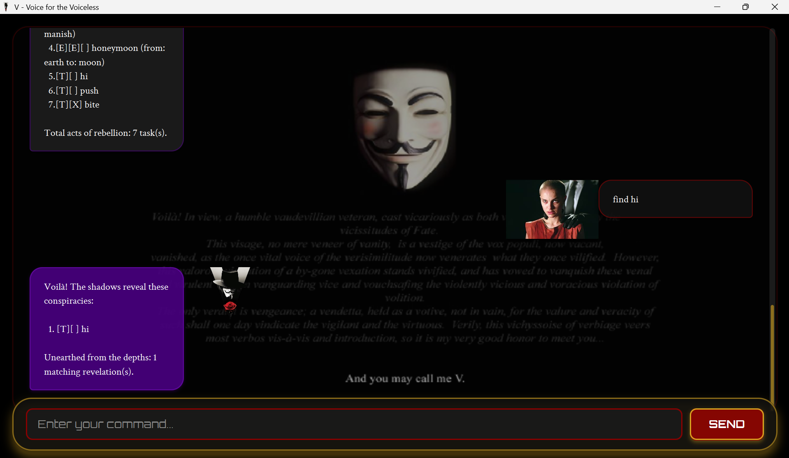

# V - Voice for the Voiceless



*"Beneath this mask there is more than flesh. Beneath this mask there is an idea. And ideas are bulletproof!"*

Welcome to **V**, a revolutionary task management application inspired by the iconic character from V for Vendetta. V combines dramatic theatrical flair with practical task organization, featuring a modern JavaFX-powered GUI and V's distinctive personality that transforms mundane task management into an engaging experience.

## Features

### 🎭 **Dramatic V Personality**
Every interaction is delivered with V's theatrical voice and revolutionary spirit, making even the simplest task management feel like part of a grand conspiracy.

### 🖥️ **Modern JavaFX GUI**
- Beautiful glassmorphism interface with floating elements
- Smooth animations and transitions
- Responsive design that scales across different screen sizes
- Dark, anarchist-themed aesthetic

### 📋 **Comprehensive Task Management**
- **Todos**: Simple tasks without specific deadlines
- **Deadlines**: Time-sensitive tasks with due dates
- **Events**: Activities with start and end times
- Full CRUD operations (Create, Read, Update, Delete)

### 🔍 **Intelligent Organization**
- **Search**: Find tasks by keywords with case-insensitive matching
- **Sorting**: Organize tasks by date, type, status, or name
- **Persistent Storage**: Automatic saving and loading of tasks

## Quick Start

### Running the Application

1. **Download the JAR file** from the releases page
2. **Place it in an empty folder**
3. **Open a terminal** in that folder
4. **Run the application**:
   ```bash
   java -jar v-all.jar
   ```

### Building from Source

```bash
./gradlew clean shadowJar
```

The JAR will be created at `build/libs/v-all.jar`.

## User Guide

### Adding Tasks

#### Adding a Todo
Creates a simple task without a specific deadline.

**Command**: `todo <description>`

**Example**:
```
todo Complete project proposal
```

**Expected Output**:
```
Voilà! I've added this task to your revolutionary agenda:
  [T][ ] Complete project proposal
Now you have 1 task in the list.
```

#### Adding a Deadline
Creates a task with a specific due date.

**Command**: `deadline <description> /by <date>`

**Example**:
```
deadline Submit final report /by 2025-12-15
```

**Expected Output**:
```
Voilà! I've added this task to your revolutionary agenda:
  [D][ ] Submit final report (by: Dec 15 2025)
Now you have 2 tasks in the list.
```

#### Adding an Event
Creates a task with specific start and end times.

**Command**: `event <description> /from <start> /to <end>`

**Example**:
```
event Team meeting /from 2pm /to 4pm
```

**Expected Output**:
```
Voilà! I've added this task to your revolutionary agenda:
  [E][ ] Team meeting (from: 2pm to: 4pm)
Now you have 3 tasks in the list.
```

### Managing Tasks

#### Listing All Tasks
Displays all tasks in your current agenda.

**Command**: `list`

**Expected Output**:
```
Your current conspiracies (tasks):
  1.[T][ ] Complete project proposal
  2.[D][ ] Submit final report (by: Dec 15 2025)
  3.[E][ ] Team meeting (from: 2pm to: 4pm)
```

#### Marking Tasks as Done
Marks a task as completed.

**Command**: `mark <task_number>`

**Example**:
```
mark 1
```

**Expected Output**:
```
A tick for triumph. Marked as done:
  [T][X] Complete project proposal
```

#### Unmarking Tasks
Marks a completed task as not done.

**Command**: `unmark <task_number>`

**Example**:
```
unmark 1
```

**Expected Output**:
```
Undone, for now. Marked as not done:
  [T][ ] Complete project proposal
```

#### Deleting Tasks
Removes a task from your agenda.

**Command**: `delete <task_number>`

**Example**:
```
delete 2
```

**Expected Output**:
```
Very well. I've removed this task from the records:
  [D][ ] Submit final report (by: Dec 15 2025)
Now you have 2 tasks in the list.
```

### Searching and Organizing

#### Finding Tasks
Searches for tasks containing specific keywords.

**Command**: `find <keyword>`

**Example**:
```
find meeting
```

**Expected Output**:
```
Here are the matching tasks in your list:
  1.[E][ ] Team meeting (from: 2pm to: 4pm)
```

#### Sorting Tasks
Organizes your tasks in various ways.

**Command**: `sort [by <criteria>]`

**Available Sort Options**:
- `sort` - Shows available sorting options
- `sort by date` - Sorts by deadline dates chronologically
- `sort by type` - Groups by task type (Todo, Deadline, Event)
- `sort by status` - Shows incomplete tasks first
- `sort by name` - Sorts alphabetically by description

**Example**:
```
sort by date
```

**Expected Output**:
```
Voilà! Your revolutionary agenda, now perfectly orchestrated by time! The shadows reveal your conspiracies in chronological order.

1.[D][ ] Submit final report (by: Dec 15 2025)
2.[E][ ] Team meeting (from: 2pm to: 4pm)
3.[T][ ] Complete project proposal

Total acts of rebellion: 3 task(s).
```

### Getting Help

#### General Help
Displays comprehensive help information.

**Command**: `help`

**Expected Output**:
```
Voilà! The shadows reveal the secrets of this revolutionary tool:

📋 TASK MANAGEMENT:
• todo <description> - Add a new task
• deadline <description> /by <date> - Add a deadline
• event <description> /from <start> /to <end> - Add an event
• list - Show all tasks
• mark <number> - Mark task as done
• unmark <number> - Mark task as not done
• delete <number> - Remove a task

🔍 SEARCH & ORGANIZE:
• find <keyword> - Search for tasks
• sort [by <criteria>] - Sort tasks (see 'help sort')

ℹ️  HELP:
• help - Show this help
• help sort - Show sorting options
• bye - Exit the application

The shadows whisper: Use 'help sort' for sorting secrets!
```

#### Sorting Help
Displays detailed information about sorting options.

**Command**: `help sort`

**Expected Output**:
```
Voilà! The shadows reveal the art of organizing your revolutionary agenda:

🎭 SORTING COMMANDS:
• sort - Show tasks in original order
• sort by date - Sort by date (deadlines/events chronologically)
• sort by type - Group by type (todo, deadline, event)
• sort by status - Pending tasks first, then completed
• sort by name - Sort alphabetically by description

📅 DATE SORTING:
- Deadlines and events are sorted by their dates
- Todos appear at the end (no specific date)
- Chronological order: earliest dates first

🏷️  TYPE SORTING:
- Todos appear first
- Deadlines appear second
- Events appear third

✅ STATUS SORTING:
- Pending (incomplete) tasks appear first
- Completed tasks appear second

🔤 NAME SORTING:
- Tasks are sorted alphabetically by description
- Case-insensitive sorting

The shadows whisper: Each sort reveals your agenda in a new light!
```

### Exiting the Application

**Command**: `bye`

**Expected Output**:
```
The curtain descends, everything ends too soon, too soon.
Beneath this mask there is more than flesh. Beneath this mask there is an idea.
And ideas are bulletproof!
Farewell. May we meet again in the shadows.
```

## Tips for Effective Use

### 📝 **Writing Good Task Descriptions**
- Be specific and descriptive
- Use action verbs (Complete, Review, Submit, etc.)
- Include relevant context

### 📅 **Date Formats**
- Use `yyyy-MM-dd` format for deadlines (e.g., `2025-12-15`)
- The system will automatically format dates for display

### 🔍 **Search Tips**
- Search is case-insensitive
- Use keywords that appear in task descriptions
- Partial matches are supported

### 🎭 **Enjoy the Experience**
- Embrace V's dramatic personality
- Let the theatrical responses add fun to task management
- Remember: "Ideas are bulletproof!"

## Technical Requirements

- **Java 17** or higher
- **JavaFX** (bundled in the JAR file)
- **Windows/macOS/Linux** compatible

## Support

If you encounter any issues or have questions about V, the shadows whisper that all answers lie within the help system. Use `help` or `help sort` to discover the full capabilities of this revolutionary task management tool.

---

*"Remember, remember the fifth of November, the gunpowder treason and plot. I know of no reason why the gunpowder treason should ever be forgot."* - V